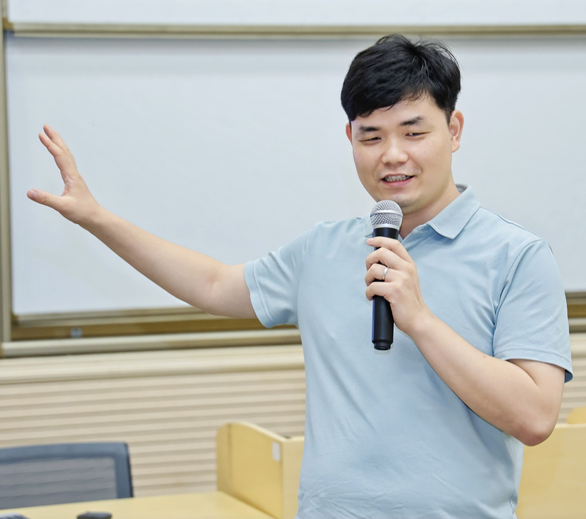

::: {.profile}
{fig-alt="Chaoqun Zhan"}

::: {.profile-text}
# Chaoqun Zhan

Assistant Professor, **Department of Accountancy, Economics and Finance**
Hong Kong Baptist University, Hong Kong SAR, China

I study how trade liberalization, foreign investment, and global supply
chains reshape what firms make, buy, and merge — and how globalization
changes the lives of workers and families in China.

[📄 CV](files/cv.pdf){.btn .btn-outline-primary .btn-sm}
[✉️ cqzhan@hkbu.edu.hk](mailto:cqzhan@hkbu.edu.hk){.btn .btn-outline-primary .btn-sm}
[🎓 Google Scholar](https://scholar.google.com/){.btn .btn-outline-primary .btn-sm}

::: {.field-tags}
[Trade Liberalization]{.field-tag}
[FDI & Multinationals]{.field-tag}
[Mergers & Acquisitions]{.field-tag}
[Global Supply Chains]{.field-tag}
[Labor & Gender]{.field-tag}
[Chinese Economy]{.field-tag}
:::
:::
:::

## About

I am an Assistant Professor in the Department of Accountancy,
Economics and Finance at Hong Kong Baptist University. Before joining HKBU
in 2023, I was an Assistant Professor at Sun Yat-sen University. I received
my Ph.D. in Economics from the University of Hong Kong in 2018, and earned
my M.A. and B.Sc. in Economics from Wuhan University.

My research lies at the intersection of international trade and industrial
organization. I use rich firm- and customs-level data, together with
input–output tables, to study how trade liberalization, foreign direct
investment, and global production networks reshape firms' boundaries,
productivity, and competitive behavior — and how these forces, in turn,
affect workers and households. My work has appeared in the *Journal of
International Economics*, *Journal of Development Economics*, 
*Journal of Comparative Economics*, and *Journal of Economic Behavior
& Organization*, among others.
